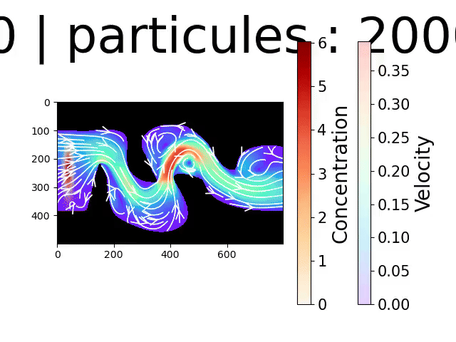

# LB

~~ A CFD program based on 2D LBM to study diffusion ~~

> Currently being improved upon for my TIPE (5/2), will be released in June/July

## demo

## quick-start

### --> Requirements

#### -> CPU version (with numpy)

Run `-$ pip3 install -r requirement-CPU.txt`, or make sure to have installed on your system :
- `numpy`
- `matplotlib`
- `scipy`

#### -> GPU version (with cupy) ~ Nvidia GPU only

Run `-$ pip3 install -r requirement-GPU.txt`, or make sure to have installed on your system :
- `CUDA`
- `cupy`
- `numpy`
- `matplotlib`
- `scipy`

#### -> running on Linux

To run the CPU version, if you are on linux, you can `-$ mkdir res && mkdir renders && chmod +x run-CPU && ./run-CPU` to start the simulation.
To run the GPU version, if you are on linux, you can `-$ mkdir res && mkdir renders && chmod +x run-GPU && ./run-GPU` to start the simulation.

#### -> running on Windows and MacOS

Create in the working dierctory a `res/` and a `renders/` folder and then run `python3 fluid.py` for the CPU version, and run `python3 fluid-cuda.py`

#### -> Options

In both cases, the `-w` flag will write the data at time `t=3000` so that it can be re-used afterward by running with the `-c` flag,  you can combine the two with `-cw` (the  flags can be applied to either `run-CPU` and `run-GPU` or the python scripts themselves)

### --> further reading / watching

- Lattice Boltzmann Method (LBM or LB) : [wikipedia's page](https://en.wikipedia.org/wiki/Lattice_Boltzmann_methods)
- First code based on this code video : [Matias Ortiz on youtube](https://youtu.be/JFWqCQHg-Hs?si=KBw4YX2WtZV_-3Ng)
- blog post that the video is inspired from : [Philip Mocz blog post](https://medium.com/swlh/create-your-own-lattice-boltzmann-simulation-with-python-8759e8b53b1c)

